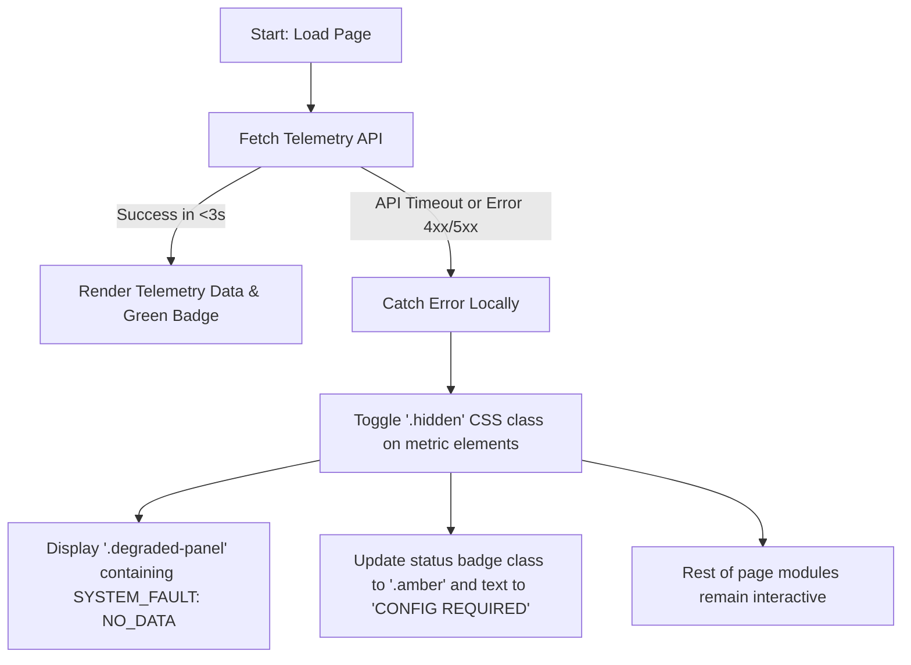

# Architecture Decision Document - mtt

This document outlines the core architectural patterns, data structures, mathematical equations, and failure handling strategies implemented in the `mtt` landing platform to meet the high performance, accessibility, and resilience objectives specified in the PRD.

---

## Architectural Decision Records (ADRs)

### ADR 01: Multi-Page Application (MPA) Static Generation with Astro

#### Context
To establish brand authority, the landing page must serve high-density interactive telemetry widgets while maintaining a Google PageSpeed Insights score of $\ge 90$ on both desktop and mobile profiles. Traditional Single-Page Applications (SPAs) load massive client-side framework bundles (React/Vue), resulting in higher Time to First Contentful Paint (FCP) and cumulative layout shifts.

#### Decision
We use the **Astro 5.0** framework to compile the landing page as a pre-rendered Multi-Page Application (MPA) using Static Site Generation (SSG). 
*   All component layouts, structural HTML, and initial static properties are compiled to pure HTML/CSS at build time.
*   Client-side JavaScript is restricted to tiny, isolated Vanilla JS script tags inside interactive components (`CardHero` and `CardSolarROI`).
*   No external framework runtimes (React, Vue, etc.) are injected into the client payload.

#### Consequences
*   **Initial Paint Performance**: FCP is kept below 500ms on a standard 3G connection due to zero blocking framework JS.
*   **SEO Optimization**: Strict semantic structure (`<header>`, `<main>`, `<section>`, `<footer>`) is pre-rendered for search indexers.
*   **Interactivity**: Client-side interactivity is handled via Vanilla JS, direct DOM bindings, and native browser events.

---

### ADR 02: Scoped Styling & Design Token System

#### Context
A clean, premium developer-centric dark aesthetic requires structured design tokens (colors, font families, transitions, focus rings). Scoping styles prevents class leakage and maintains layout integrity.

#### Decision
*   **Global CSS Tokens**: Core design tokens are declared in [global.css](file:///home/danielaroko/applications/mtt/astro/src/styles/global.css) using CSS custom properties (`:root`).
    *   *Deep Tech Dark*: `--color-bg: #0A0A0A`
    *   *Tactile Card BG*: `--color-card-bg: #141414`
    *   *Grid Boundary*: `--color-border: #262626`
    *   *Success Green*: `--color-success: #66BB6A`
    *   *Info Blue*: `--color-info: #29B6F6`
    *   *Alert Amber*: `--color-alert: #FFB74D`
    *   *High-Contrast White*: `--color-text: #F5F5F5`
    *   *Typography*: Serif titles utilize `Fraunces`, body copy utilizes `Outfit`, and monospaced elements utilize `JetBrains Mono`.
*   **Component-Scoped Styling**: Astro `<style>` tags are compiled locally for each component, appending unique hashes (e.g. `data-astro-cid-xxxx`) to CSS selectors, guaranteeing styling encapsulation.
*   **Keyboard Accessibility focus ring**: Focus rings on focusable components are enforced via `outline: 2px solid var(--color-info); outline-offset: 4px;` in focus states.

---

### ADR 03: V2H Telemetry Interface & Data Schema

#### Context
The `CardHero` component displays live Vehicle-to-Home (V2H) arbitrage spreads, battery State of Charge (SoC), State of Health (SoH), and utility rate tiers. We require a clear interface protocol for these telemetry endpoints to support transition from mock data to real API polling in the future.

#### Data Model Spec
The API response must conform to the following JSON schema:
```json
{
  "status": "string",       // E.g., "V2H_ACTIVE", "MAINTENANCE"
  "gridRate": "number",     // Price in CAD/kWh, e.g. 0.352
  "batterySoc": "number",   // Integer percentage, e.g., 82
  "batterySoh": "number",   // Integer percentage, e.g., 98
  "rateTier": "string"      // E.g., "ULO_PEAK", "ULO_OFF_PEAK", "TOU_MID_PEAK"
}
```

#### Integration Constraints
*   **Fetch Endpoint**: The component queries `/api/telemetry-data` via standard browser `fetch()`.
*   **Request Timeout**: A maximum timeout threshold of 3000ms is enforced on client side. If the fetch does not resolve in 3 seconds, a client-side timeout handler aborts the request and triggers the fallback degraded state.

---

### ADR 04: Solar ROI Mathematical Formulas & Regional Constants

#### Context
The `CardSolarROI` widget must calculate solar yield, savings, and payback period on the client thread with sub-50ms input latency to satisfy NFR-P3. The formulas must represent Ontario-specific conditions.

#### Ontarian Mathematical Constants
*   **Solar Yield Constant ($Y_{\text{Ontario}}$)**: Average of $1,150 \text{ kWh}$ of electrical energy generated per $1 \text{ kW}$ of installed solar panel capacity per year (derived from NREL PVWatts formulas for Southern Ontario / Toronto region).
*   **Net-Metering Rate Model**: Under Ontario Regulation 541/05, energy generated is credited against the consumption volume. The payback model assumes that 100% of solar generation offsets electricity consumption directly at the current average electricity tariff rate $R$, up to the user's total consumption.

#### Calculation Formulas
1.  **Estimated Annual Solar Yield ($E_{\text{annual}}$ in kWh)**:
    $$E_{\text{annual}} = S \times Y_{\text{Ontario}}$$
    Where $S$ is the system size input (in kW).
    
2.  **Estimated Annual Financial Savings ($Savings_{\text{annual}}$ in CAD)**:
    $$Savings_{\text{annual}} = E_{\text{annual}} \times R$$
    Where $R$ is the utility rate input (in CAD/kWh, e.g., $0.15$ to $0.35$).
    
3.  **Solar ROI Payback Period ($P$ in years)**:
    $$P = \frac{Cost_{\text{installation}}}{Savings_{\text{annual}}}$$
    Where $Cost_{\text{installation}}$ is the estimated installation cost, computed at a regional baseline solar installation rate of $\$2,800$ per installed kW:
    $$Cost_{\text{installation}} = S \times 2800$$
    Substituting terms simplifies the payback period calculation to a constant-based ratio:
    $$P = \frac{S \times 2800}{(S \times 1150) \times R} = \frac{2800}{1150 \times R} \approx \frac{2.4348}{R}$$

#### Performance Constraints
All slider dynamic modifications must run in a lightweight event listener. DOM text modifications are directly bound to range input changes to ensure the output calculations render in $<50\text{ms}$.

---

### ADR 05: Isolated Fault Containment

#### Context
In accordance with NFR-R1 and NFR-R2, external telemetry failures must not break the layout or prevent interactions with other cards (such as the Solar ROI calculator).

#### Failure Isolation Mechanism


#### Verification & Recovery
A diagnostic loop is built into the degraded container:
*   Clicking `[RUN_DIAGNOSTICS]` triggers a Javascript timeout loop that simulates diagnostic checks.
*   The button displays a dynamic cycling monospaced spinner (`\`, `|`, `/`, `-`) using an interval loop.
*   After $1.5$ seconds, the diagnostic cycle resolves and toggles the UI back to live simulated metrics, allowing users to manually test both live and degraded UI states.
