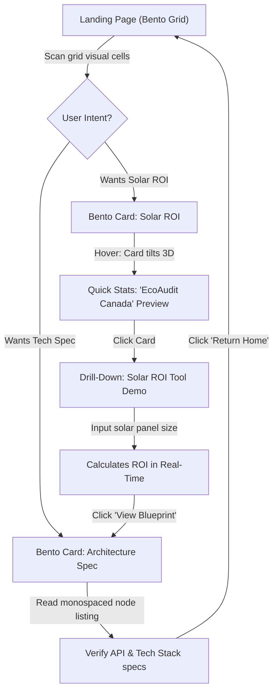
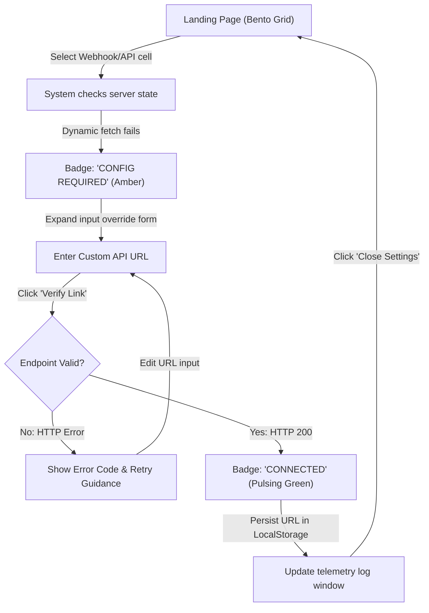

# UX Design Specification mtt

**Author:** Danielaroko
**Date:** 2026-05-22

---

<!-- UX design content will be appended sequentially through collaborative workflow steps -->

## Executive Summary

### Project Vision
Maple Tyne Technologies operates as a premium Tech Venture Studio and Engineering Firm specializing in high-utility orchestration. The brand represents the intersection of robust, local-first engineering and elegant automated solutions—powering infrastructure across energy, apparel, and financial systems. The flagship product experience focuses on AI-native energy management, specifically optimizing vehicle-to-home (V2H) energy spreads and battery protection with zero manual overhead.

### Target Users
1. **The Energy Autonomist (Homeowner & Tech Adopter)**: Individuals with home solar, stationary battery storage, or V2H-compatible EVs who want to maximize their energy ROI. They care deeply about data privacy, require absolute proof of hardware safety (like battery wear protection), and want to understand their savings without needing an engineering degree.
2. **The Venture Partner / Co-Builder**: Investors and prospective venture partners who visit the site to gauge Maple Tyne's capability. They evaluate the studio's portfolio (e.g., *EcoAudit Canada*, *Solar ROI Tool*, *Invoice Generator*) to see real-world, high-utility execution.
3. **The Systems Engineer**: Technical visitors looking for specifications, API connectivity, and operational blueprints. They respect clean documentation and want to see the technology stack clearly illustrated.

### Key Design Challenges
* **Explaining Complex Spreads Simply**: Energy arbitrage, utility tariff structures, and battery cycling are highly technical. The UX must turn abstract equations into intuitive visual models (like cycle flows) so homeowners can confidently delegate automation to the AI.
* **Designing the "Invisible UI"**: The core product promise is *"Zero Manual Effort."* How do we design an interface for something that is supposed to run in the background? We must focus on status visibility, confidence scoring, and high-trust transparency rather than heavy interactive controls.
* **Cohesive Portfolio Presentation**: Representing diverse venture offerings (from solar ROI calculators to invoicing) without diluting the primary focus on automated energy orchestration.

### Design Opportunities
* **Tactile Bento Grid**: Leveraging modern, glassmorphic cards with responsive hover transitions to structure the studio's diverse portfolio. This gives each venture its own "pod" while keeping the overall page unified.
* **Interactive Blueprint Elements**: Using technical layouts (JetBrains Mono labels, green blueprint accents) to make the page feel like an active engineering dispatch, establishing high credibility.

---

## Core User Experience

### Defining Experience
The core user experience of Maple Tyne Technologies is **Active Verification with Zero Overhead**. The primary action is passive: visitors or clients consume high-density, real-time operational status (such as active V2H arbitrage spreads, solar calculator estimations, or active venture dispatches) and immediately recognize the engineering integrity of the venture studio. 

* **The Core Loop**: Scan Portfolio Bento Grid $\rightarrow$ Tap to Drill-Down into Venture/Tech Spec $\rightarrow$ Read System Blueprint/Blog $\rightarrow$ Launch/Troubleshoot Application.
* **The Promise**: High-utility automation should be invisible, but its results and underlying architecture must be crystal clear.

### Platform Strategy
* **Device Access**: Cross-platform Web (Responsive Desktop & Mobile). Because homeowners monitor energy arbitrage on their phones, mobile reading and status indicators are prioritized. Engineers and investors typically explore the venture portfolio and deep-dives on desktop, demanding a premium wide-screen bento layout.
* **Input Modality**: Hybrid (optimizing for mouse hovers on desktop to reveal sub-details, and smooth, tap-friendly card grids on mobile).
* **Technical Constraints**: Quick loading and static asset optimization to maintain a PageSpeed score of 90+, even with high-contrast graphics and diagrams.

### Effortless Interactions
* **Ambient Orchestration Status**: Users should see whether systems are actively optimization-ready without navigating through pages. The primary menu bar and bento statuses provide clear, icon-driven indicators.
* **One-Tap Venture Entry**: Visitors can drill down into any of the portfolio apps (like the *Invoice Generator* or *Solar ROI Tool*) directly from the landing bento grid without multi-step onboarding.

### Critical Success Moments
* **The "Blueprint Click"**: The moment an engineer or investor hovers over a bento card (e.g. CardHero, CardTechStack) and it tilts with a tactile shadow, instantly revealing engineering specs (e.g., node servers, local inference rates, active API connections).
* **The Energy Insight Realization**: When a client views the `V2H_Energy_Arbitrage_Cycle_Diagram` and immediately understands how charging their EV during low tariff periods and discharging during peak times generates real financial spreads.

### Experience Principles
1. **Engineering Credibility through Visual Density**: Avoid watered-down summaries. Use precise metrics, JetBrains Mono tags, and schematic borders to present an uncompromisingly professional engineering layout.
2. **Ambient, Not Interruptive**: Keep user notifications and manual configuration inputs minimal. The AI coordinates in the background, only surfacing telemetry summaries.
3. **Responsive Blueprinting**: Layouts must preserve their technical alignment across all screen sizes. Text tables and code blocks should stack neatly without breaking grids.
4. **Coherent Modular Branding**: Every subsidiary tool (e.g. *Solar ROI*, *Invoice Generator*) maintains the dark-mode aesthetic and layout pattern, building a unified ecosystem.

---

## Desired Emotional Response

### Primary Emotional Goals
* **Sovereign Confidence**: Users must feel a profound sense of ownership and control over their data, home parameters, and integrations (V2H, API endpoints).
* **Engineering Trust**: Technical visitors, co-builders, and clients should feel reassured that the system is built with bulletproof architecture, safety parameters (like battery protection), and local execution privacy.
* **Intriguing Focus**: A feeling of quiet focus that draws users into the technical articles and specific calculations without cognitive fatigue.

### Emotional Journey Mapping
* **First Discovery**: *Awe & Validation.* The immediate impression is, "This is premium and mathematically serious." (Driven by sleek dark mode, Geist headers, and clear blueprint details).
* **Core Action / Exploration**: *Intellectual Engagement.* Tapping bento items or browsing technology tabs feels responsive and reveals high-density utility (tactile grid layout).
* **Error / Fault State**: *Reassurance & Control.* If a background connection or auto-detection fails, the user is never left in the dark. Instead of generic alerts, they get actionable technical details and manual configuration overrides (e.g., manual API URL inputs), preserving their sense of agency.
* **Return Visits**: *Familiar Calm.* Returning to monitor telemetry or read the blog feels like opening a well-calibrated terminal.

### Micro-Emotions
* **Trust vs. Skepticism**: Overcoming AI-skepticism by exposing concrete architectural links (like MCP nodes) and local inference details.
* **Calm vs. Alarm**: Replacing flash alerts with glowing ambient badges. Green signifies active orchestration; quiet amber indicates a manual configuration fallback is active.
* **Accomplishment vs. Overwhelm**: Segmenting complex data tables and code segments into clean, toggleable panels (like SVG/PDF diagram exporters).

### Design Implications
* **Sovereign Control** $\rightarrow$ Render local-first security badges and data privacy shields prominently in the navigation and tech pages.
* **High-Trust Protection** $\rightarrow$ Show explicit "Safe Mode Active" or "Battery Health: 98%" metrics beside arbitrary V2H spread percentages to prove the backend protects hardware.
* **Calm Recovery** $\rightarrow$ Build elegant UI override forms (e.g., webhook configurations) that look like part of the developer console.

### Emotional Design Principles
1. **Agency at the Edge**: Automation should never lock the user out. If auto-detection fails, always expose manual overrides in a clean troubleshooting tab.
2. **Ambient Assurance**: Build confidence using static, non-blinking visual cues (subtle dark card gradients, green tactile borders) that represent systemic stability.
3. **Intellectual Respect**: Do not hide complexity. Treat the user as a capable partner by labeling actions and data points precisely (using JetBrains Mono).

---

## UX Pattern Analysis & Inspiration

### Inspiring Products Analysis
* **Linear / Vercel (Developer Tools)**:
  * *What they do well*: Sleek dark-mode aesthetic, highly structured layouts, tactile card borders, and JetBrains Mono code tags that command developer trust.
  * *UX Lessons*: Leverage micro-animations (subtle card tilts, glowing hover states) to make static text grids feel like highly responsive interfaces.
* **Tesla Energy / Enphase (Grid/Telemetry Visualizers)**:
  * *What they do well*: Visualizing power routing (Solar $\rightarrow$ Battery $\rightarrow$ Grid) using clean animated nodes and simple arrow paths.
  * *UX Lessons*: Replace wordy paragraphs with a diagram that maps the direction of electricity and battery charges (like the V2H arbitrage loop).

### Transferable UX Patterns
* **Navigation Patterns**:
  * *Glassmorphic Sticky Header*: A thin sticky header with a blurred background (`backdrop-filter`) that preserves context as the user scrolls, keeping key links (Ventures, Technology, About, Blog) always accessible.
* **Interaction Patterns**:
  * *Bento Cards with Tactile Hover*: Cards that lift slightly and shift border colors (from gray `--color-border` to bright green `--color-accent`) on hover, indicating interactivity and depth.
* **Visual Patterns**:
  * *SVG Arrow Flows*: Highlighting energy transfer directions using animated dash-arrays on SVG vectors to show current battery state (charging vs. discharging) dynamically.

### Anti-Patterns to Avoid
* **Blinking "Alarm" Triggers**: Avoid loud flashing alerts or warning red styles. Power systems naturally fluctuate; UX should represent state changes with calm ambient colors (green for active, gray/amber for configuration).
* **Vague Technical Clichés**: Avoid marketing speak like *"Intelligent Systems"* without supporting data. Users expect concrete engineering proofs (like specific node versions, local inference execution status, or calculated spreads).
* **Control Overload**: Avoid complex dials or parameters that risk misconfiguration. The automation is self-driving, so the UI should prioritize *status verification* over granular control.

### Design Inspiration Strategy
* **Adopt**: The grid aesthetics, strict alignment, and tactile feedback patterns of developer platforms like Linear.
* **Adapt**: The visual flows of Enphase telemetry, translating them into lightweight static SVG assets to ensure a 90+ PageSpeed score.
* **Avoid**: Dynamic JavaScript-heavy dials. Focus on clean read-only telemetry with simple text fallback controls when manual overrides are needed.

---

## Design System Foundation

### Design System Choice
**Custom Design System** built on CSS Custom Properties (CSS variables) coupled with modular, lightweight Astro HTML/CSS components.

### Rationale for Selection
1. **Uncompromised Performance**: Avoids heavy CSS-in-JS runtimes or bulky Tailwind processing in final builds, supporting the 90+ PageSpeed score target.
2. **True-to-Mockup Fidelity**: The dark-mode engineering layout requires precise control over glassmorphic overlays, custom borders (`#262626`), and hover transitions (3D shadow tilt) which are best done with pure CSS.
3. **Developer-Designer Alignment**: By defining tokens directly in [global.css](file:///home/danielaroko/applications/mtt/astro/src/styles/global.css), the developer can use semantically named tokens like `--color-accent` and `--font-mono` directly in Astro template files without configuration files.

### Implementation Approach
1. **Semantic Token Structure**: Theme tokens (backgrounds, text, borders, accents) are declared in `:root` and overridden in `[data-theme="dark"]`.
2. **Standardized Spacing & Grids**: Utilizing CSS custom variables or standard flex/grid gaps for uniform component alignments.
3. **Modular Astro Components**: Encapsulating styles inside Astro components (e.g., `<BentoCard />`, `<TelemetryBadge />`) to maintain scope and prevent style leakage.

### Customization Strategy
* **Accent Colors**: Main Brand Green (`#66BB6A`) for active/healthy telemetry states; Secondary Blue (`#29B6F6`) for secondary details; Accent Amber (`#FFB74D`) for warnings or manual override falls.
* **Typography Hierarchy**: Headings use `Fraunces` for editorial gravity; UI copy uses `Outfit` for clean readability; labels, metrics, and terminal elements use `JetBrains Mono`.
* **Tactile Interactions**: All interactive elements (links, buttons, bento cards) utilize a standard transition transition duration of `0.3s ease` for ambient response on focus/hover.

---

## 2. Core User Experience Deep Dive

### 2.1 Defining Experience
The defining experience of Maple Tyne Technologies is the **"Interactive Dispatch & Telemetry Verification."** 
Rather than reading static descriptions of portfolio items, the user interacts with a live dashboard. The defining interaction is the **"Drill-down Bento Reveal"**: hovering or tapping a bento card (e.g., V2H Arbitrage, Solar ROI, or dynamic Webhook configurations) tilts the element, shifts its borders to the brand accent color (`#66BB6A` or `#29B6F6`), and dynamically expands its details. This interaction proves the studio's engineering focus.

### 2.2 User Mental Model
* **The Energy Autonomist**: They treat solar and EV battery spreads like a home appliance console. Their mental model is physical (flow of electricity from roof to car) and financial (cost vs. savings). They expect autopilot safety (e.g., battery degradation protections) to run implicitly, with an ambient dashboard showing status.
* **The System Engineer / Partner**: They view the studio portfolio through the lens of a software developer console (resembling Vercel or Linear). They expect visible architecture connections (MCP, Node versioning) and developer terminal details (JetBrains Mono tags, raw API statuses).

### 2.3 Success Criteria
* **The "Zero Config" Magic**: Users get a real-time calculated spread or portfolio overview with zero required forms.
* **Sub-150ms Status Indicator Updates**: Glowing status badges for API connections and dynamic webhook auto-detection update immediately on load.
* **Tactile Responsiveness**: Bento cells shift and layout cleanly on desktop and mobile without breaking font sizing or table rows.
* **Isolated Failure States**: If an API endpoint is unresponsive, only the affected Bento card shows a "Configuration Required" status (with a text field fallback), keeping the rest of the layout operational and accessible.

### 2.4 Novel UX Patterns
* **Inline Config Overrides within Bento**: Placing configuration overrides (such as overriding the `Chat History API URL` setting) directly inside a tabbed view of a Bento card rather than deep in a separate settings page.
* **Zero JS SVG Flow Vectors**: Visualizing active energy arbitrage loops using pure CSS animations (`stroke-dashoffset`) on inline SVGs, keeping the Astro page lightweight for a 90+ PageSpeed score.
* **Ambient Glow Badges**: Utilizing soft CSS shadow pulses around telemetry status labels to indicate live connectivity without loud flashing alerts.

### 2.5 Experience Mechanics
1. **Initiation**: The visitor lands on the homepage and sees the portfolio bento layout. A top header telemetry bar displays `SYS_STATUS: ACTIVE`.
2. **Interaction**:
   * The user hovers or taps a card (e.g., Webhook card). The card tilts slightly on a 3D axis using CSS transform perspective.
   * The user opens the "Webhook" tab, revealing the dynamic API endpoint detection status.
3. **Feedback**:
   * If auto-detection fails, the user types their custom endpoint. The input box uses a terminal command style.
   * On validation, the status text transforms from an amber `DISCONNECTED / CONFIG REQUIRED` to a green `CONNECTED` tag.
4. **Completion**: The webhook override is persisted in `localStorage`. The card returns to its default preview state, presenting green telemetry indicators and live console log mocks.

---

## Visual Design Foundation

### Color System
We utilize a dark-mode-first color palette with highly tailored light mode overrides, reflecting the studio's engineering-first focus:

*   **Primary Background**: `#0A0A0A` (Deep Tech Dark) providing a sleek backdrop for illuminated telemetry.
*   **Card Background**: `#141414` (Glassmorphic Container) creating immediate depth layers.
*   **Borders**: `#262626` (Subtle Gridlines) establishing layout boundaries without clutter.
*   **Brand Primary (Success/Active)**: `#66BB6A` (Vibrant Leaf Green) indicating operational health and energy savings.
*   **Brand Secondary (Neutral/Info)**: `#29B6F6` (Electric Blue) highlighting technical details and navigation paths.
*   **Alert/Configuration Mode**: `#FFB74D` (Calm Amber) signaling configuration states and user options.
*   **Text (Primary)**: `#F5F5F5` (High-Contrast White) for effortless readability.

### Typography System
Typography is structured to balance editorial brand authority with technical developer readability:

*   **Font Families**:
    *   *Headings*: `Fraunces` (Serif, weights 700-900). Adds editorial gravity, making the studio's ventures look like premium, high-value entities.
    *   *Body/UI Copy*: `Outfit` (Sans-Serif, weights 300-600). Modern, circular geometric shapes that are highly legible on all display scales.
    *   *Data/Labels*: `JetBrains Mono` (Monospaced, weights 400-600). Direct, computer-console aesthetic indicating raw metrics and status flags.
*   **Type Scale**:
    *   `h1`: `Outfit` or `Fraunces` — `3.5rem` (56px) / Line Height `1.1` (Landing headers)
    *   `h2`: `Fraunces` — `2.25rem` (36px) / Line Height `1.2` (Section headers)
    *   `h3`: `Outfit` — `1.5rem` (24px) / Line Height `1.3` (Card titles)
    *   `body`: `Outfit` — `1rem` (16px) / Line Height `1.6` (UI Copy)
    *   `monospace-tag`: `JetBrains Mono` — `0.75rem` (12px) / Line Height `1.0` (Telemetry details)

### Spacing & Layout Foundation
The structural grid uses an 8px logical unit (`0.5rem`) to enforce visual rhythm and alignment:

*   **Grid Structure**: A responsive 12-column bento layout on desktop (`max-width: 1200px`), scaling down to a 6-column grid on tablets (`max-width: 1024px`), and stacking to a 1-column list on mobile viewports (`max-width: 768px`).
*   **Padding Scale**:
    *   *Card Padding*: `2.5rem` (40px) providing ample room to display technical charts.
    *   *Section Gaps*: `4rem` (64px) preventing visual overlap.
    *   *Card Gap*: `2rem` (32px) maintaining separate interactive targets.
*   **Corner Radii**: Tactile elements use a uniform border-radius of `12px` to soften card corners, balanced by sharp internal grids.

### Accessibility Considerations
*   **Color Contrast**: Light grey text (`#F5F5F5`) against deep charcoal background (`#0A0A0A`) exceeds the WCAG AAA contrast ratio requirements. Accent green (`#66BB6A`) and blue (`#29B6F6`) are only used for indicators or key labels where they meet WCAG AA standards.
*   **Interactive Targets**: Responsive links and menu buttons maintain a minimum tap target height of `48px` on mobile viewports to prevent misclicks.
*   **Text Scaling**: Sizing definitions use relative root sizing (`rem` units) so text scales smoothly when font settings are adjusted at the browser level.

---

## Design Direction Decision

### Design Directions Explored
We explored six interactive visual mockups in our [Design Directions Showcase](file:///home/danielaroko/applications/mtt/_bmad-output/planning-artifacts/ux-design-directions.html):
1.  **Developer Console Vibe**: Monospaced typography (`JetBrains Mono`), neon indicators, raw console status logs.
2.  **Premium Consumer Tech (Vercel Style)**: Dark radial gradients, sans-serif copy, wide margined columns, glowing hover containers.
3.  **Hardware Telemetry Blueprint**: Grid schematic lines with animated current paths showing electricity routing.
4.  **Editorial Serif Minimalist**: Generous whitespace, thin dividers, and deep italic `Fraunces` headings.
5.  **Dynamic Dashboard Widget Layout**: Modular telemetry cards displaying live calculations, ROI indices, and webhooks.
6.  **Bento Grid Hub**: A cohesive grid of modular cards displaying venture capabilities with tilting mouse-tracking animations.

### Chosen Direction
We have selected **Direction 6 (Bento Grid Hub)** as our layout framework, enhanced by incorporating elements from:
*   **Direction 1 (Console Density)**: Integrating monospace tags and API connection details inside the bento containers for technical credibility.
*   **Direction 3 (Blueprint Flows)**: Embedding inline SVG active flow paths with pure CSS animations to illustrate electrical spreads.

### Design Rationale
*   **Consolidated Portfolios**: Bento grids allow us to represent subsidiary ventures (Invoice generator, Solar ROI) as independent modules without diluting the primary V2H system focus.
*   **Aesthetic & Speed Harmony**: Using CSS grids and lightweight inline SVGs guarantees a **90+ PageSpeed score** while delivering a highly interactive experience.
*   **Tactile Verification**: The 3D tilting card feedback immediately communicates activity and responsiveness.

### Implementation Approach
1.  **Grid Layout**: Code a 12-column responsive layout container in `src/pages/index.astro`.
2.  **Modular Bento Components**: Build customizable Astro components (`<BentoCard />`, `<TelemetryBadge />`) to maintain unified styles.
3.  **Pure CSS Path Animation**: Leverage `stroke-dashoffset` keyframe loops on inline vectors to animate V2H flows without loading external script frameworks.

---

## User Journey Flows

### Journey 1: Venture Capability Verification
*Goal: A prospective venture builder or investor evaluates Maple Tyne's engineering credentials by testing the Solar ROI tool and checking its underlying system blueprint.*

### Journey 2: Webhook Endpoint Recovery
*Goal: A developer troubleshooting the AI Diagram Generator overrides the auto-detected server URL with a manual Cloudflare Tunnel endpoint to restore functionality.*

### Journey Patterns
1.  **Tabbed Bento Drill-Down**: Interactive panels occur directly inside bento cell wrappers. This ensures users do not lose their visual context when adjusting configurations.
2.  **Color-Coded Telemetry Badges**: System status is indicated via standard semantic glows. A green glow implies active orchestration, amber signals manual configuration needed, and red means immediate system error.
3.  **Command-Line Style Fields**: Form fields are styled like terminal consoles to command technical familiarity for engineers.

### Flow Optimization Principles
*   **Zero-Setup Demos**: Users can interact with calculators (Solar ROI) immediately on cell click without registering for an account.
*   **Graceful Degraded States**: If a network connection is lost, only the affected card alerts the user. The rest of the site remains responsive.
*   **One-Click persistence**: Manual configurations auto-save to `localStorage` on verification success, avoiding the need for multi-step "Save Changes" screens.

---

## Component Strategy

### Design System Components
We leverage primitive tokens and layout helpers from our custom Vanilla CSS foundation:
*   **Grid Container (`.bento-grid`)**: The base responsive wrapper that handles column math across screen sizes.
*   **Typography Containers**: Styling tags that apply `Outfit` for body text, `Fraunces` for titles, and `JetBrains Mono` for tags.
*   **Tactile Card Layout (`.tactile-card`)**: Neutral containers that handle base shadows, margins, and background colors.

### Custom Components

#### 1. `<BentoCard />`
*   **Purpose**: A container element that introduces physical, tilting feedback to the bento grid.
*   **Anatomy**: Wrapper div with `perspective: 1000px` enclosing a card content container.
*   **States**:
    *   *Default*: Laying flat with subtle dark border (`#262626`).
    *   *Hover*: Rotated slightly on X/Y axes toward the user's cursor, with a glowing green accent border.
*   **Variants**: `col-span-1` (33% width), `col-span-2` (66% width), `col-span-3` (100% width).
*   **Accessibility**: Implements keyboard focus outlines (`tabindex="0"`) and acts as a link wrapper where relevant.
*   **Interaction**: CSS transform adjustments bound to mouse move coordinates (`--x`, `--y` custom variables).

#### 2. `<TelemetryBadge />`
*   **Purpose**: An ambient, non-distracting indicator representing real-time API or system connectivity.
*   **Anatomy**: SVG circle wrapper containing an outer glow element and inner solid status indicator.
*   **States**:
    *   *Active (Green)*: System running normally; soft glowing pulse.
    *   *Action Required (Amber)*: Auto-detection failed; steady amber indicator.
    *   *Offline (Gray)*: System disconnected.
*   **Variants**: Micro (for navigation bar), standard (for card headers).
*   **Accessibility**: Implements `role="img"` and `aria-label="System status: Active"`.
*   **Interaction**: Read-only indicator updating immediately on endpoint validation.

#### 3. `<ArbitrageFlow />`
*   **Purpose**: A visual SVG schematic showing the current direction of EV and solar charging spreads.
*   **Anatomy**: A flow chart composed of node items linked by SVG path vectors.
*   **States**:
    *   *Charging (Solar $\rightarrow$ EV)*: Vector path dashes move toward the EV node.
    *   *Arbitrage Discharge (EV $\rightarrow$ Home)*: Vector path dashes move from EV toward house.
*   **Variants**: Full schematic (for energy management details), micro diagram (for preview grid).
*   **Accessibility**: High-contrast labels mapped beside each node; screen-reader fallback description provided in an `aria-describedby` block.
*   **Interaction**: Static layout using CSS animation loops on stroke properties.

#### 4. `<WebhookConsole />`
*   **Purpose**: An override settings panel embedded inside a tabbed Bento Card cell to handle webhook parameters.
*   **Anatomy**: Outer tab control wrapper containing a dark input field, validation button, and telemetry logs viewport.
*   **States**:
    *   *Default*: Displaying current auto-detected path.
    *   *Editing*: Active keyboard focus, highlighted border.
    *   *Verifying*: Disables input and button, shows a small spinning loader.
*   **Variants**: None.
*   **Accessibility**: Fully labeled inputs with clear placeholder text; keyboard navigation supports `Tab` entry and `Enter` to submit.
*   **Interaction**: Validates endpoints in real-time, displaying network feedback inside the console log.

### Component Implementation Strategy
Custom Astro components are structured to bundle CSS locally within component files. Scoped variables inherit layout sizes from `global.css`, but specific animations and interactive JavaScript are scoped within components. This isolates styling, prevents side-effects, and supports PageSpeed loading by avoiding global bloat.

### Implementation Roadmap
*   **Phase 1 - Core Layout (Sprint Week 1)**: Build `<BentoCard />` containers and `<TelemetryBadge />` to establish structure.
*   **Phase 2 - Technical Settings (Sprint Week 1)**: Implement the `<WebhookConsole />` to solve dynamic configuration override tasks.
*   **Phase 3 - Visual Polish (Sprint Week 2)**: Design the CSS-animated `<ArbitrageFlow />` vectors to enrich visual storytelling.

---

## UX Consistency Patterns

### Button Hierarchy

*   **Primary Call-to-Action**: Used for primary user operations (e.g. running calculators, launching apps).
    *   *Visuals*: Solid green accent (`#66BB6A`) background or thick green border with white bold text.
    *   *Hover*: Background shifts HSL tone slightly; light shadow glow is added.
*   **Secondary/Auxiliary Action**: Used for page navigation or secondary controls (e.g. "View spec", tab changes).
    *   *Visuals*: Transparent background with thin borders (`#262626`) and light grey text.
    *   *Hover*: Border color shifts to blue (`#29B6F6`).
*   **Utility/Console Action**: Styled to match developer utilities (e.g. "FETCH_LOGS", "TEST_API").
    *   *Visuals*: Bracketed monospaced uppercase text (e.g. `[RUN_TEST]`) using `JetBrains Mono`.
    *   *Hover*: Solid green background with text color inverted to black.

### Feedback Patterns

*   **System Indicators**: Ambient glows representing live connectivity. Badges pulse slowly when connected.
*   **Telemetry Console Feed**: Diagnostic outputs update at the bottom of widget cells as logs (e.g. `[15:20:01] SYS_STATUS: CONNECTED`) rather than standard modal alerts.
*   **Validation States**: Successful input changes display green indicators immediately; invalid parameters render as amber flags. Warnings or system failures use a steady red indicator.

### Form Patterns

*   **Terminal Inputs**: Webhook override fields look like active developer inputs.
*   **Focus Behaviors**: Active inputs shift border colors to blue (`#29B6F6`) with no default browser outline.
*   **In-Line Action Validation**: Real-time HTTP fetches run automatically as the user types, displaying connection feedback directly beside the input box without interrupting the user.

### Navigation Patterns

*   **Glassmorphic Header**: A sticky navbar with a translucent dark fill (`rgba(10, 10, 10, 0.8)`) and CSS filter blur (`backdrop-filter: blur(10px)`).
*   **Active Indicator**: The current route shows a thin accent green underline under the nav link.
*   **Grid Alignments**: Primary navbar links align with the boundaries of the bento grid columns beneath them.

### Additional Patterns

*   **Empty Telemetry States**: When data is unavailable, widgets render a monospace placeholder reading `NO_DATA // RUN DIAGNOSTICS`.
*   **Dynamic Loading Indicators**: Telemetry fields display a spinning monospace cursor (e.g. `\`, `|`, `/`, `-`) during verification loops.

---

## Responsive Design & Accessibility

### Responsive Strategy

*   **Desktop Layout (1024px and above)**: 
    *   *Grid Setup*: Full 12-column Bento Grid system with a maximum content container width of `1200px`.
    *   *Real Estate Utilization*: Spreads out portfolio cards and deep technical badges side-by-side, preserving high visual density and telemetry overview columns.
    *   *Interactive State*: Full 3D tilt tracking bound to mouse coordinates (`perspective: 1000px` transforms).
*   **Tablet Layout (768px - 1023px)**: 
    *   *Grid Setup*: Adapts to a 6-column grid structure.
    *   *Touch Optimization*: Disables active cursor-tracking 3D card tilt animations to prevent touch lag; replaces it with clean, tactile tap-highlight states.
    *   *Density*: Preserves side-by-side layouts for smaller modules, but stacks main feature items like V2H arbitrage diagrams onto separate rows.
*   **Mobile Layout (Below 768px)**: 
    *   *Grid Setup*: Collapses to a single-column (1-column) vertical list stack.
    *   *Navigation*: Glassmorphic sticky header transitions to a clean hamburger modal menu or a dense, thumb-accessible bottom bar depending on routing density.
    *   *Content Priority*: Displays the primary telemetry header (`SYS_STATUS: ACTIVE`), followed by core interactive widgets (Solar ROI, Webhook console override) in high-contrast text views, dropping secondary decorative grids to conserve vertical scrolling height.

### Breakpoint Strategy

We enforce a strictly mobile-first breakpoint logic using standard viewport ranges. This ensures all components default to their simplest vertical stack and scale up modularly:
*   `--breakpoint-mobile`: Default stylesheet styles up to `767px` viewport width.
*   `--breakpoint-tablet`: `@media (min-width: 768px)` for tablet adaptations.
*   `--breakpoint-desktop`: `@media (min-width: 1024px)` for desktop grids and mouse-based interactions.
*   `--breakpoint-large`: `@media (min-width: 1280px)` for wide desktop centered alignments.

### Accessibility Strategy

To align with professional developer expectations and legal specifications, we commit to **WCAG 2.1 Level AA Compliance** across all pages:
*   **Contrast Standards**: Primary text in light-grey (`#F5F5F5` on `#0A0A0A` background) guarantees a contrast ratio greater than `14:1`, well exceeding Level AAA. Telemetry colors (Leaf Green `#66BB6A` and Blue `#29B6F6`) are only applied to structural labels and badges that maintain high contrast against card wrappers (`#141414`).
*   **Keyboard Navigation**: Every interactive bento widget implements logical tab indexing (`tabindex="0"`) and clear focus states. Focus indicator rings use a bright blue border highlight (`outline: 2px solid #29B6F6`, `outline-offset: 4px`).
*   **Screen Reader Support**: All visual widgets (like the `<ArbitrageFlow />` SVG flow vectors) include an `aria-label` or `aria-describedby` reference linking to detailed screen-reader-only summary tables (`.sr-only`).
*   **Interactive Target Sizing**: On mobile viewports, all buttons and interactive cards feature a minimum touch target size of `48px x 48px` to guarantee physical accessibility.

### Testing Strategy

*   **Responsive Viewport Testing**: 
    *   *Simulated Viewports*: Validate page rendering on Chrome DevTools responsive presets (iPhone SE, iPad Air, 1080p Desktop).
    *   *Device Checks*: Test physical rendering on iOS Safari and Android Chrome to verify touch responses and scroll physics.
*   **Accessibility Audits**: 
    *   *Automated Scans*: Run Lighthouse Accessibility audits and axe-core browser scans, targeting a perfect score of 100/100.
    *   *Manual Keyboard Checks*: Perform keyboard-only sweeps of the site to verify that focus order is logical and no focus traps exist.
    *   *Screen Reader Audits*: Walk the page using VoiceOver (macOS/iOS) or TalkBack (Android) to verify semantic headers and image descriptions.

### Implementation Guidelines

*   **Responsive Engineering Rules**:
    *   Never use hardcoded pixel widths (`width: 320px`) for major layout blocks. Always utilize relative units (`rem`, `%`, `vw`) and flexbox/grid alignments.
    *   Declare all custom breakpoints inside CSS variables in `global.css` to prevent duplicate ad-hoc breakpoint values in component files.
    *   Optimize static SVG drawings using responsive aspect-ratios (`viewBox`) so vectors scale cleanly across viewports.
*   **Accessibility Engineering Rules**:
    *   Maintain strict semantic HTML hierarchy (e.g. one `<h1>` per page, sequential `<h2>` and `<h3>` tags).
    *   Never disable default browser focus indicators without replacing them with highly visible custom outlines.
    *   All buttons and form elements must have visible, machine-readable text labels (avoid icon-only buttons without screen-reader helper tags).
